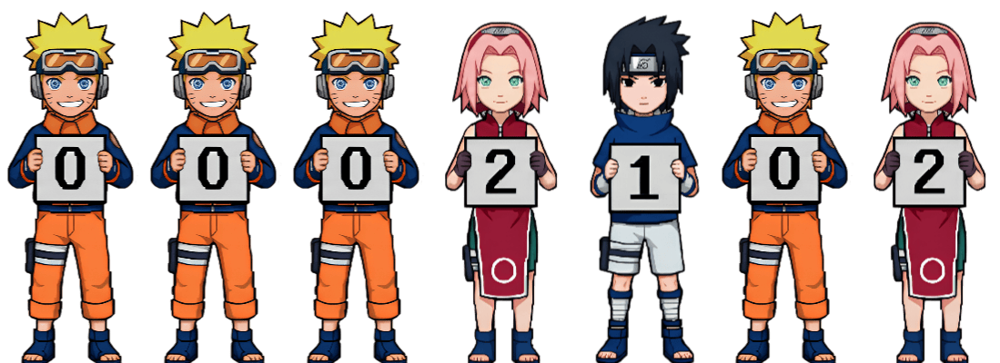

<div align="center">


<samp>self-taught developer · full stack · bots & automation</samp>

<!-- Keep the original Komarev identity alive so the accumulated total is never reset. -->


</div>


> Self-taught developer focused on turning useful ideas into working software.

I build full-stack products, Discord bots, backend services, and automation.<br>
Most of my work currently lives in private repositories, where I experiment,<br>
ship quickly, and keep improving the systems behind the scenes.


<samp>typescript &nbsp; python &nbsp; javascript &nbsp; react &nbsp; next.js &nbsp; node.js &nbsp; fastapi &nbsp; rust &nbsp; go &nbsp; postgresql &nbsp; redis &nbsp; docker &nbsp; git</samp>


<div align="center">


</div>


<!--START_SECTION:waka-->
```text
GitHub:
Contributions 2026       4807
Current streak           0 days
Longest streak           69 days
Public repos             1
Private repos            104


Total this week   0 secs
Languages:
Python               61.5%        ███████████████░░░░░░░░░░   61.49 %
TypeScript           25.9%        ██████░░░░░░░░░░░░░░░░░░░   25.90 %
CSS                  5.1%         █░░░░░░░░░░░░░░░░░░░░░░░░   5.13 %
JavaScript           2.8%         ░░░░░░░░░░░░░░░░░░░░░░░░░   2.76 %
Lua                  1.6%         ░░░░░░░░░░░░░░░░░░░░░░░░░   1.56 %

Editors:
Visual Studio Code   15 hrs 57 mins ████████████████████░░░░░   80.84 %
Cursor               3 hrs 46 mins ████░░░░░░░░░░░░░░░░░░░░░   19.11 %
OS:
Windows              19 hrs 38 mins █████████████████████████   100.00 %
```

*Last updated: 12/09/2026 03:58:37 UTC*

<!--END_SECTION:waka-->


<div align="center">



</div>


The GitHub graphics on this page are generated by [this repository](.github/workflows/stats.yml)<br>
once a day and committed only when something changes. The visitor graphic keeps<br>
the original Komarev counter identity, preserving the existing total, then renders<br>
that number as Naruto-themed character digits.

The coding-time section remains connected to the existing WakaTime updater, so<br>
private language, editor, and operating-system activity can continue to sync.
