<samp>self-taught developer · full stack · bots & automation</samp>

<!-- Preserve the original Komarev counter identity. -->

> Self-taught developer focused on turning useful ideas into working software.

I build full-stack products, Discord bots, backend services, and automation. 
Most of my work lives in private repositories, where I experiment, ship quickly, 
and keep improving the systems behind the scenes.

 
<samp>TypeScript · Python · JavaScript · Rust · Go · Lua · HTML · CSS</samp>

 
<samp>React · Next.js · Node.js · FastAPI · Tailwind · Vite · Bun · Discord.js · Prisma</samp>

 
<samp>VS Code · Codex · After Effects · Photoshop · Illustrator · Blender · Git · GitHub · Docker · PostgreSQL · Redis · Vercel · Cloudflare</samp>

  

